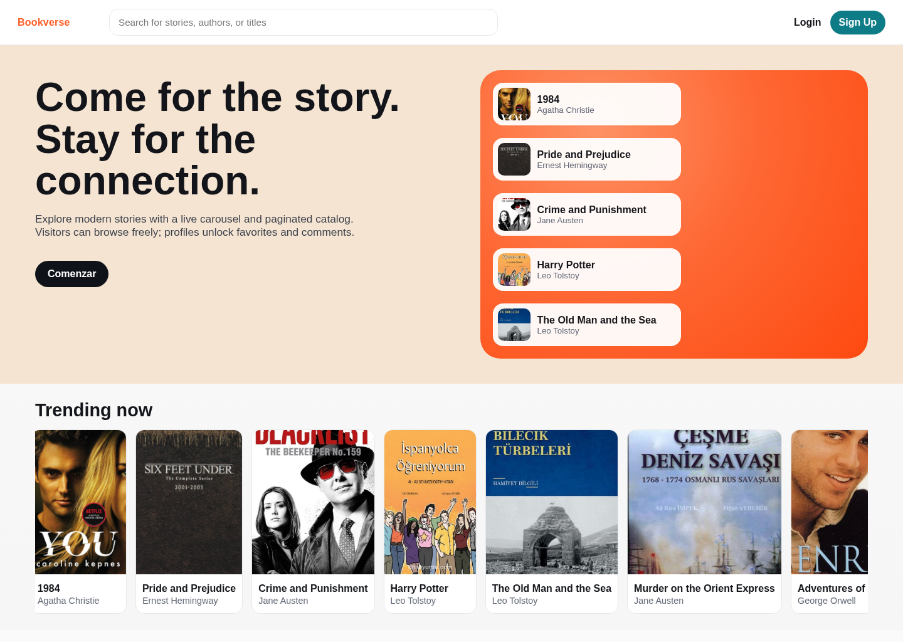
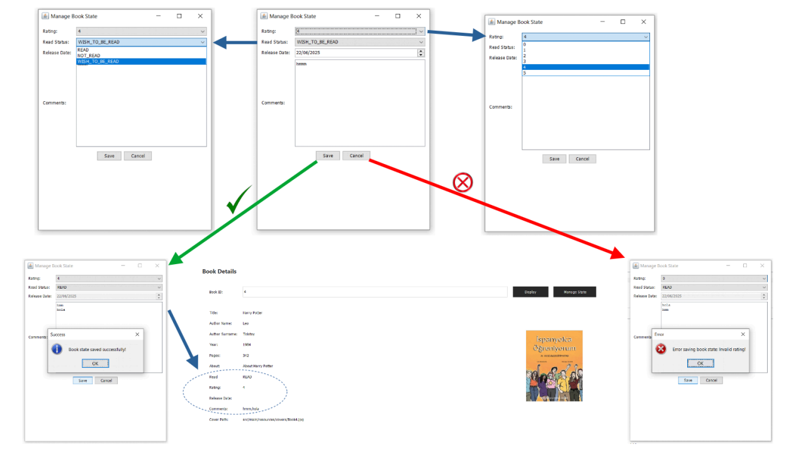
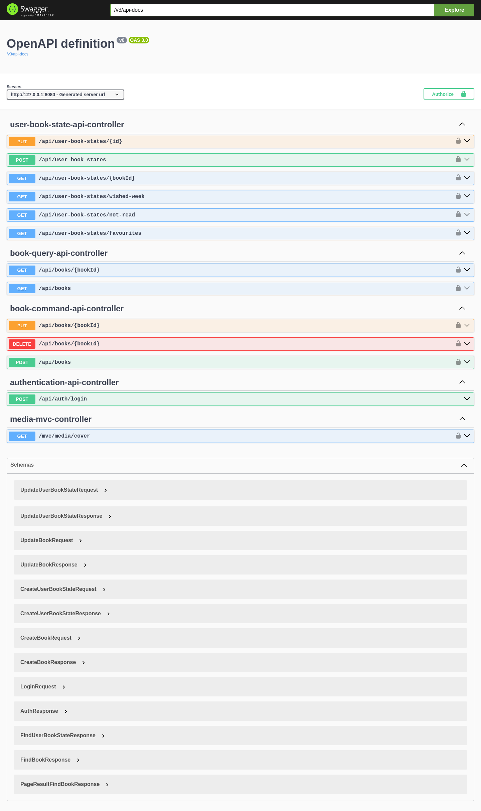

# Book Library (Onion Architecture, Hexagonal Architecture, Domain Driven Design), CQRS & A Lot Of Technologies (Spring Boot, Spring MVC, OpenApi, Thymeleaf, Spring Security, Spring Data, H2, Docker, Mysql etc...)





A library manager built with hexagonal architecture principles and clean architecture domain-driven design (DDD), including patterns such as CQRS.

It now supports the original Swing user interface, Spring MVC and the Spring Boot REST API, with Spring Data JPA + H2 configured for the Spring run profile while retaining the same application/domain core. For Swing usage, Docker has been used to use MySQL as the infrastructure DB.

- for Spring, run directly [SpringApiApplication.java](src/main/java/com/finalproject/SpringApiApplication.java)
- for Swing
    - run [docker-compose.yaml](src/main/resources/db/docker-compose.yaml)
    - then run [SwingDesktopApplication.java](src/main/java/com/finalproject/SwingDesktopApplication.java)
- accounts for testing: {alice, yasar1}, {bob, yasar2}
## Architecture Overview

### Hexagonal boundaries

- **Inbound ports (driving adapters):** Swing/Spring MVC/Spring REST views call application services through `application.ports.input.services` interfaces. This keeps UI logic interchangeable while preserving domain rules.
- **Outbound ports (driven adapters):** Persistence, security, encryptors, and clock abstractions live under `application.ports.output`. Infrastructure implements them with JDBC, JPA adapter repositories, password encryption, and system time utilities, enabling replacement without touching domain code.

### Layer responsibilities

- **Presentation**
    - **Spring REST** - OpenAPI + OpenAPI Security for use of user Bearer tokens
    - **Swing UI** – Screens (Login, FavoriteBooks, FavoriteAuthors, UnreadBooks, WishlistNotification, etc.) gather user intent and delegate to application services without embedding business logic.
    - **Spring Mvc UI** - Screens (Main, Search Books, Login, Profile, Favourites, etc.)
- **Application layer** – Coordinates use cases, permission checks, and transactions. Book use cases are split with CQRS (`BookCommandApplicationService` + `BookQueryApplicationService`) and work alongside `UserApplicationService` and other services to orchestrate repositories, mappers, and security ports while enforcing high-level workflows.
- **Domain layer** – Aggregates like `Book`, `Author`, `User`, and `UserBookState` encapsulate business rules. Validation methods (`validate()`) protect invariants such as rating ranges, sensible publication years, release date ordering, and mandatory author names. Violations raise domain exceptions to keep rule enforcement close to the model.
- **Infrastructure layer** – JDBC repositories implement persistence ports; `JdbcUnitOfWork` scopes transactional work; `CypherPasswordEncryptor` fulfills the password hashing/verification port; `CurrentUserHolder` (thread-local) implements the security context port; `DatabaseConfig` centralizes connection lifecycle.

## Security & Thread-local session handling

- **Password hashing** – The `PasswordEncryptor` output port abstracts credential hashing/verification. `CypherPasswordEncryptor` encrypts and matches passwords before persistence or authentication, isolating crypto details from the UI and application layers.
- **Thread-local user context** – Authentication populates a thread-local `CurrentUser` holder. Application services read this context to authorize admin-only actions (create/update/delete books, orphan author cleanup) without passing session state through every method. UI classes only trigger login; they never cache credentials or user objects directly.
    - Since Spring runs on a per-request thread model, an adapter has been used which, underneath, uses SecurityContextHolder.
- **Permission checks** – Services guard mutations with role checks (reader vs. admin) and emit domain errors when callers lack rights, keeping enforcement centralized.

## Domain business rules (DDD focus)

- **Aggregate invariants** – `Book.validate()` constrains publication year ranges and required fields; `UserBookState.validate()` bounds ratings, restricts release dates to logical windows, and ensures status transitions remain consistent.
- **Consistency between aggregates** – Book workflows ensure authors are created on demand and removed when no books reference them. User-book state updates keep comments, ratings, and statuses aligned with the owning `User` aggregate and the target `Book`.
- **Explicit ubiquitous language** – DTOs, entities, and services share domain vocabulary (wishlist, favorites, unread list, read status) to keep intent clear across layers.
- **Error surfacing** – Domain exceptions bubble up to the UI, allowing screens to show descriptive validation or permission messages without duplicating rules.

## Key Features

- **User authentication** with thread-local session storage for downstream authorization.
- **Role-based catalog administration** for creating, updating, and deleting books with transactional author maintenance.
- **Reading state tracking** (read/unread/wishlist), ratings, comments, and optional release dates enforced by domain validation.
- **Favorites and shortcuts** surfaced through dedicated UI screens for quick navigation.
- **Secure credential handling** via the password encryptor port and infrastructure implementation.
- **Transactional persistence** coordinating repositories inside `JdbcUnitOfWork` to keep cross-aggregate updates atomic.

## Project Structure

```
src/main/java/com/finalproject
├── presentation
│   ├── spring             # Spring API starter + REST controllers (inbound adapters)
│   └── swing              # Swing starter, views, and swing bootstrap wiring
├── application            # Use cases, ports, mappers, and application DTOs
├── domain                 # Entities, value objects, domain exceptions (core model)
└── infrastructure
    ├── configuration      # Spring security/openapi/bean configuration
    ├── persistence
    │   ├── jdbc           # JDBC adapters for Swing runtime
    │   └── jpa            # JPA adapters/entities/repositories for Spring runtime
    └── security           # Shared security helpers/context
```

## Database & Infrastructure

- **H2 + JPA setup** – Spring runtime uses H2 (`jdbc:h2:mem:mylibrary`) and Spring Data JPA. Schema and seed data are loaded automatically from `src/main/resources/db/h2/schema.sql` and `src/main/resources/db/h2/data.sql`.
- **Connection management** – `DatabaseConfig` is a lightweight singleton that loads the H2 driver, provides connections, and offers a shutdown helper.
- **Transaction boundary** – `JdbcUnitOfWork` wraps JDBC operations, handling commit/rollback around supplied actions to keep application service workflows consistent.

## Running the Application

- Swagger UI: `http://localhost:8080/swagger-ui/index.html`
- OpenAPI JSON: `http://localhost:8080/v3/api-docs`
- Use the **Authorize** button in Swagger with `Bearer <your_token>` (token from `/api/auth/login`).
- Only `/api/auth/login` is open; all other `/api/**` endpoints require JWT authentication.

## Development Standards & Practices

- **DDD building blocks** – Entities and value objects enforce invariants through `validate()` methods and domain-specific exception types.
- **Ports & adapters** – Interfaces in `application.ports.input` and `application.ports.output` decouple use cases from transport, storage, and security implementations.
- **Explicit mapping** – Mapper classes translate between DTOs and domain objects to keep UI and persistence concerns away from domain models.
- **Manual dependency injection** – `DependencyInjector` wires concrete infrastructure implementations into application services without a container, keeping wiring explicit and testable.
- **Security separation** – Authentication state is held in thread-local context objects, and password handling goes through the `PasswordEncryptor` abstraction to avoid leaking crypto details.
- **Error handling** – User-facing flows catch `DomainException` instances to surface validation or permission errors in the UI.
- **Java standards** – Uses Java 17, conventional package naming, builder patterns for domain objects, and immutable IDs/value objects to minimize shared mutable state.

## Resources

- **Report** – See `Swing-Report.pdf` for the original project write-up.
- **Initial data** – Cover images referenced in seed data live under `src/main/resources/covers/`.

---

## Technology Stack

| Category | Technology | Notes |
|---|---|---|
| Language | Java 17 | Records, sealed types, text blocks |
| Framework | Spring Boot 3.3.5 | Auto-configuration, embedded Tomcat |
| Web MVC | Spring MVC + Thymeleaf | Server-rendered pages, Thymeleaf Security extras |
| REST | Spring Web (Jackson) | JSON serialization/deserialization |
| API docs | springdoc-openapi 2.6 | Swagger UI, OpenAPI 3 spec |
| Security | Spring Security 6 | Stateless JWT chain (`/api/**`) + session chain (`/mvc/**`) |
| Auth tokens | JJWT 0.12.6 | HS256 signed JWTs; claims: `userId`, `username`, `userType` |
| ORM | Spring Data JPA / Hibernate | Spring runtime persistence |
| Raw JDBC | Custom JDBC adapters | Swing runtime persistence against MySQL |
| DB (Spring) | H2 in-memory | `jdbc:h2:mem:mylibrary`; schema + seed auto-applied |
| DB (Swing) | MySQL 8 (Docker) | Full relational schema, pre-seeded DML |
| Containers | Docker + docker-compose | MySQL service for Swing runtime |
| Desktop UI | Java Swing | NetBeans `.form` + `.java` pairs |
| Build | Maven 3 | Spring Boot Maven Plugin |
| Boilerplate | Lombok | `@RequiredArgsConstructor`, `@Builder` where applicable |
| Java versions | Java 17 | `var`, sealed interfaces, pattern matching |

---

## Architecture Diagram

```
╔══════════════════════════════════════════════════════════════════╗
║                       PRESENTATION (UI)                          ║
║                                                                  ║
║  ┌──────────────┐  ┌──────────────────┐  ┌───────────────────┐  ║
║  │  Spring REST │  │   Spring MVC     │  │   Swing Desktop   │  ║
║  │  /api/**     │  │   /mvc/**        │  │   (JFrame/JPanel) │  ║
║  │  JWT + OpenAPI│  │  Thymeleaf+Sec  │  │  DependencyInjector│ ║
║  └──────┬───────┘  └────────┬─────────┘  └────────┬──────────┘  ║
╚═════════╪══════════════════╪═══════════════════════╪════════════╝
          │                  │                       │
          │   application.ports.input.services (interfaces only)
          ▼                  ▼                       ▼
╔══════════════════════════════════════════════════════════════════╗
║                     APPLICATION LAYER                            ║
║                                                                  ║
║   BookCommandApplicationService   BookQueryApplicationService   ║
║   UserApplicationService          AuthorApplicationService      ║
║   UserBookStateApplicationService                               ║
║                                                                  ║
║   application.ports.output.* (interfaces — never implemented here)║
╚═════════════╪══════════════════════════════════╪════════════════╝
              │ domain objects only               │ port calls
              ▼                                   ▼
╔══════════════════╗          ╔═══════════════════════════════════╗
║   DOMAIN LAYER   ║          ║       INFRASTRUCTURE LAYER        ║
║                  ║          ║                                   ║
║ Book             ║          ║  Spring runtime:                  ║
║ Author           ║          ║  ├─ JPA entity adapters           ║
║ User             ║          ║  ├─ Spring Data repositories      ║
║ UserBookState    ║          ║  ├─ JWT filter + BCrypt encoder   ║
║ 14 Value Objects ║          ║  └─ SecurityContextHolder adapter ║
║ 9 Exceptions     ║          ║                                   ║
║ validate()       ║          ║  Swing runtime:                   ║
╚══════════════════╝          ║  ├─ JDBC adapters (MySQL)         ║
                              ║  ├─ JdbcUnitOfWork                ║
                              ║  ├─ DatabaseConfig singleton      ║
                              ║  └─ ThreadLocal CurrentUser holder║
                              ╚═══════════════════════════════════╝
```

**Dependency rule**: every arrow points inward. Domain has zero external dependencies. Application depends only on Domain. Infrastructure and Presentation depend on Application and Domain — never the reverse.

---

## Domain Model (DDD)

### Entity hierarchy

```
BaseEntity<ID>          abstract — holds typed ID, declares validate()
├── Book                year [1000–currentYear], pages [0–10 000], cover, about
├── Author              name, surname, optional website URL
├── User                username, hashed password, UserType (READER | ADMIN)
└── Comment             content string with CommentId

AggregateRoot<ID>       extends BaseEntity — marks true consistency boundary
└── UserBookState       userId FK + bookId FK + Read enum + Rating + comments + ReleaseDate
```

`UserBookState` is the primary aggregate: reading status, ratings (0–5, minimum 1 when READ), comments, and optional wishlist release dates are all validated together in a single `validate()` call before any persistence operation.

### Value Objects (14)

| Value Object | Type | Invariant enforced |
|---|---|---|
| `BookId` | `int` wrapper | Typed identity, prevents accidental mixing with `AuthorId` |
| `AuthorId` | `int` wrapper | Typed identity |
| `UserId` | `int` wrapper | Typed identity |
| `CommentId` | `int` wrapper | Typed identity |
| `UserBookStateId` | `int` wrapper | Typed identity |
| `Year` | `int` wrapper | Must be in `[1000, LocalDate.now().getYear()]` |
| `NumberOfPages` | `int` wrapper | Must be in `[0, 10 000]` |
| `Cover` | `String` wrapper | Path string; file-existence validation available (disabled for seed path compatibility) |
| `Rating` | `int` wrapper | `0–5`; tightened to `1–5` when `read == READ` |
| `Read` | `enum` | `READ`, `NOT_READ`, `WISH_TO_BE_READ` |
| `ReleaseDate` | `LocalDate` wrapper | **Must be present** iff `read == WISH_TO_BE_READ`; **must be null** otherwise |
| `UserType` | `enum` | `READER`, `ADMIN` |
| `Website` | `String` wrapper | URL string for author portfolio |
| `BaseId<T>` | Generic abstract | Shared equals/hashCode on raw value for all typed IDs |

### Domain Exception Hierarchy

```
DomainException (RuntimeException)
├── BookDomainException          — validation failures on Book
├── BookNotFoundException        — no book found for a given BookId
├── AuthorDomainException        — validation failures on Author
├── AuthorNotFoundException      — no author found for BookId/AuthorId
├── UserDomainException          — permission checks, role violations
├── UserNotFoundException        — no user found for credentials/id
├── UserBookStateDomainException — state/rating/releaseDate inconsistencies
└── UserBookStateNotFoundException — no state record found for user+book
```

All exceptions are unchecked. Application services catch nothing — they propagate up to the presentation layer, where Thymeleaf templates or REST exception handlers translate them into user messages or HTTP status codes.

---

## CQRS in Practice

### Why CQRS here

The book catalog has very different read vs. write profiles: reads are frequent, public, and paginated; writes are infrequent, admin-gated, and transactional. Separating the two services means:
- Read optimizations (projection, caching) never pollute the command model.
- The command path is easier to reason about: it's always admin-only, always wrapped in a `UnitOfWork`, always followed by `validate()`.

### Command side — `BookCommandApplicationService`

| Method | Guard | Transaction | Side-effects |
|---|---|---|---|
| `createBook(CreateBookCommand)` | `ADMIN` | `UnitOfWork` | Creates `Author` on-demand if name+surname not found |
| `updateBook(UpdateBookCommand)` | `ADMIN` | `UnitOfWork` | Creates new `Author` on-demand; **deletes old `Author`** if it has no remaining books |
| `deleteBook(DeleteBookCommand)` | `ADMIN` | `UnitOfWork` | **Deletes `Author`** if it has no remaining books |

### Query side — `BookQueryApplicationService`

| Method | Input | Output |
|---|---|---|
| `find(GetBookQuery)` | `bookId: int` | `FindBookResponse` or `BookNotFoundException` |
| `findAll(SearchBooksQuery)` | `title?: String`, `PageQuery(page, size)` | `PageResult<FindBookResponse>` |

`PageResult<T>` is a generic record:  
`(List<T> content, int page, int size, long totalElements, int totalPages, boolean first, boolean last)`  
with a `map(Function<T,S>)` utility for transforming content without rebuilding pagination metadata.

### UserBookState operations

| Method | Permission | Description |
|---|---|---|
| `findUserBookOfCurrentUser(bookId)` | Any authenticated | Returns reading state for a book + defaults if no record exists |
| `findUserBookStatistics(bookId)` | Any authenticated | Aggregate: `totalReads`, `averageRating`, `commentsCount` |
| `findFavouriteBooksOfCurrentUser()` | Any authenticated | Books where `rating >= 3` |
| `findNotReadBooksYetOfCurrentUser()` | Any authenticated | Books with no state record + records with `NOT_READ` combined |
| `findWishedBooksToReadThatWillBeDoneIn1WeekOfCurrentUser()` | `ADMIN` | Wishlist entries with `releaseDate` within the next 7 days |
| `createUserBookForCurrentUser(request)` | Any authenticated | Calls `UserBookState.validate()` before save |
| `updateUserBookForCurrentUser(request)` | Owner only | Verifies `userId == currentUser.id` before update |

---

## Dual Runtime Design

The project demonstrates that the same application/domain core can run against completely different infrastructure stacks:

| Concern | Swing (original) | Spring (extended) |
|---|---|---|
| **Entry point** | `SwingDesktopApplication` | `SpringApplication` |
| **DI container** | Manual `DependencyInjector` class | Spring IoC (`@Bean`, `@Service`) |
| **Persistence** | JDBC adapters — raw `PreparedStatement`/`ResultSet` | JPA adapters — Spring Data `JpaRepository` |
| **Database** | MySQL 8 via Docker | H2 in-memory — zero external deps |
| **Transaction** | `JdbcUnitOfWork` (`autoCommit=false`, manual commit/rollback) | Spring `@Transactional` (via JPA adapter) |
| **User session** | `ThreadLocal` `CurrentUser` holder | `SecurityContextHolder` adapter |
| **Auth** | `CypherPasswordEncryptor` (BCrypt) | Spring Security + BCrypt + JWT |
| **UI** | Java Swing (`JFrame`, `JPanel`, `JTable`, `.form`) | Thymeleaf HTML templates + REST JSON |

Neither runtime knows about the other. The application and domain layers compile and run identically in both contexts — the only difference is which beans are wired in the `DependencyInjector` vs. Spring's context.

---

## Security Architecture

### JWT flow (REST API)

```
Client                    Spring Security                Application layer
  │                            │                               │
  │  POST /api/auth/login      │                               │
  │──────────────────────────► │                               │
  │                            │  UserApplicationService       │
  │                            │ ──────────────────────────── ►│
  │                            │  PasswordEncryptor.matches()  │
  │                            │ ◄──────────────────────────── │
  │                            │  JwtTokenProvider.generate()  │
  │◄────────── {token} ─────── │                               │
  │                            │                               │
  │  GET /api/books (Bearer)   │                               │
  │──────────────────────────► │                               │
  │                JwtAuthenticationFilter                      │
  │                validates token, sets SecurityContext        │
  │                            │  CurrentUserHolderAdapter     │
  │                            │  reads SecurityContextHolder  │
  │                            │ ──────────────────────────── ►│
  │                            │  isAdmin() / getId() checks   │
  │◄────────── response ─────── │ ◄──────────────────────────── │
```

### Spring Security filter chain separation

Two independent filter chains prevent them from interfering:

```java
@Order(1) ApiSecurityConfig   → securityMatcher("/api/**")  — stateless, JWT
@Order(2) MvcSecurityConfig   → securityMatcher("/mvc/**")  — stateful, form login
```

### Port abstraction benefit

`CurrentUser` and `PasswordEncryptor` are *output port interfaces* in the application layer. This means:
- The application layer never imports `io.jsonwebtoken`, `BCryptPasswordEncoder`, or `SecurityContextHolder`.
- Swapping BCrypt for Argon2 or JWT for PASETO requires changing only one infrastructure class.

---

## Swing Screens (12)

| Screen | Class | Access | Description |
|---|---|---|---|
| Login | `Login.java` | Public | Username/password form; calls `UserApplicationService`; populates `CurrentUser` thread-local |
| Main Dashboard | `MainPanel.java` | Authenticated | Navigation hub; shows user info and buttons to all sub-screens |
| Display Book | `DisplayBook.java` | Authenticated | Full book detail: cover, metadata, reading state buttons |
| Book Operations | `BookOperations.java` | Admin | Lists all books; entry to create/edit/delete flows |
| Book Creation | `BookCreation.java` | Admin | Form to create a book + author; calls `BookCommandApplicationService.createBook()` |
| Book Edit | `BookEdit.java` | Admin | Pre-filled edit form; calls `updateBook()` |
| Reading State Manager | `BookStateManager.java` | Authenticated | Sets `Read` status, `Rating`, `comments`, optional `releaseDate` |
| Favourite Books | `FavoriteBooks.java` | Authenticated | Books rated ≥ 3 via `findFavouriteBooksOfCurrentUser()` |
| Favourite Authors | `FavoriteAuthors.java` | Authenticated | Authors of the user's favourite books |
| Unread Books | `UnreadBooks.java` | Authenticated | Books with `NOT_READ` or no state record |
| Wishlist Notification | `WishlistNotification.java` | Admin | Wishlist entries due within 7 days |
| Search Author | `SearchAuthor.java` | Authenticated | Author search by name |

---

## REST API Quick Reference

### Authentication

```bash
POST /api/auth/login
Content-Type: application/json

{ "username": "alice", "password": "yasar1" }
```

**Response:**
```json
{ "id": 1, "username": "admin", "userType": "ADMIN", "token": "<JWT>" }
```

All other endpoints require `Authorization: Bearer <JWT>`.

### Book endpoints

```bash
# Paginated catalogue
GET /api/books?page=0&size=10

# Title search
GET /api/books?title=refactoring&page=0&size=5

# Single book
GET /api/books/{id}

# Create (ADMIN, 201 Created)
POST /api/books
{
  "authorName": "Martin", "authorSurname": "Fowler",
  "title": "Refactoring", "year": 2018,
  "numberOfPages": 448, "about": "Improving existing code",
  "coverPath": "src/main/resources/covers/Book1.jpg"
}

# Update (ADMIN, 200 OK)
PUT /api/books/{id}          { same fields }

# Delete (ADMIN, 204 No Content)
DELETE /api/books/{id}
```

### Reading state endpoints

```bash
# Get my state for a book
GET /api/user-book-states?bookId={id}

# Create my state
POST /api/user-book-states
{
  "bookId": 1,
  "read": "READ",
  "rating": 5,
  "comments": ["Highly recommended"]
}

# Wishlist entry (WISH_TO_BE_READ requires releaseDate)
POST /api/user-book-states
{
  "bookId": 2,
  "read": "WISH_TO_BE_READ",
  "rating": 0,
  "releaseDate": "2025-03-01"
}

# Update
PUT /api/user-book-states/{id}   { same fields }
```

Default test credentials: **admin / 123** (ADMIN) · **reader / 123** (READER)

---

## Design Patterns Reference

| Pattern | Implementation | Location |
|---|---|---|
| **Hexagonal / Ports & Adapters** | Input/output port interfaces; all adapters implement ports, never extend domain | `application.ports.*` + all `infrastructure.*` |
| **Domain-Driven Design** | Entities, aggregate roots, value objects, domain exceptions, ubiquitous language, `validate()` | `domain.*` |
| **CQRS** | Separate command and query application service interfaces and implementations | `BookCommandApplicationService*` / `BookQueryApplicationService*` |
| **Repository** | Port interface + JDBC adapter + JPA adapter per aggregate | `ports.output.repository.*` |
| **Unit of Work** | `UnitOfWork` `@FunctionalInterface` port; `JdbcUnitOfWork` wraps commit/rollback | `UnitOfWork.java`, `JdbcUnitOfWork.java` |
| **Builder** | Every aggregate and entity exposes a nested `Builder` with fluent setters | `Book.Builder`, `Author.Builder`, `User.Builder`, `UserBookState.Builder` |
| **Factory Method** | `Book.Builder.newBuilder()`, `User.Builder.newBuilder()` | Domain entity builders |
| **Adapter** | JPA ↔ domain mappers; JDBC adapters; `PasswordEncoderImpl`; `CurrentUserHolderAdapter` | `infrastructure.*` |
| **Strategy** | JDBC vs JPA persistence strategies injected behind the same port interface | Dual runtime — same port, two implementations |
| **Template Method** | `BaseEntity.validate()` declared abstract; each entity provides its own rules | `BaseEntity`, `Book`, `UserBookState` |
| **Facade** | Application services present a simple interface over domain + UnitOfWork + multiple repos | All `*ApplicationServiceImpl` classes |
| **Null Object** | `findUserBookStatistics` returns a zero-value `FindUserBookStatisticsResponse` instead of null | `UserBookStateApplicationServiceImpl` |
| **Singleton** | `DatabaseConfig` manages one shared JDBC connection lifecycle for Swing runtime | `DatabaseConfig.java` |
| **Dependency Injection (manual)** | `DependencyInjector` wires concrete classes without a container — makes dependencies explicit | `presentation.swing.dependency` |

---

## Quick Start

```bash
# Clone
git clone <repo-url>
cd book-library-jdbc-swing

# Run Spring (REST + MVC, H2 auto-starts)
mvn spring-boot:run

# Then open:
open http://localhost:8080/mvc/books           # Web UI
open http://localhost:8080/swagger-ui/index.html  # API docs
```

| URL | Description |
|---|---|
| `/mvc/books` | Thymeleaf home — hero section + trending carousel |
| `/mvc/books/{id}` | Book detail — stats, user rating & comments |
| `/mvc/login` | Form login |
| `/swagger-ui/index.html` | Interactive API explorer |
| `/v3/api-docs` | Raw OpenAPI 3 JSON |

| User | Password | Role |
|---|---|---|
| `admin` | `123` | ADMIN — full CRUD |
| `reader` | `123` | READER — reading states only |

